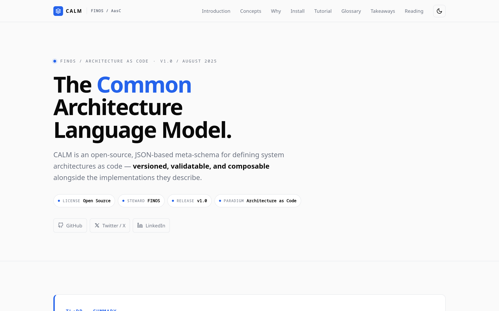

# calm-architecture-introduction

[](./LICENSE)
[](https://github.com/finos/architecture-as-code)
[](https://github.com/topics/architecture-as-code)
[](./index.html)
[](./index.html)

**TL;DR** — A single-file, self-contained HTML primer on the [FINOS Common Architecture Language Model (CALM)](https://github.com/finos/architecture-as-code), aimed at architects in regulated environments (banking, payments, capital markets). Open `index.html` in a browser. That's it.



---

## What this repo is

An architect-to-architect introduction to CALM — what it is, why it matters for Tier 1 financial institutions, how to install it on Ubuntu, a hands-on tutorial, and a glossary. The entire site is one `index.html` file: no build step, no framework, no server. Drop it on any static host (GitHub Pages, S3, internal docs portal) or open it locally.

CALM was open-sourced by Morgan Stanley through FINOS in August 2025 as a machine-readable specification for system architectures — JSON Schema for your architecture, validated in CI, with controls (FAPI 2.0, PCI-DSS 4.0, DORA, SWIFT CSCF) embedded in the model.

## Contents of `index.html`

| §  | Section          | What it covers                                                                  |
| -- | ---------------- | ------------------------------------------------------------------------------- |
| 01 | Introduction     | Why architecture-as-code, the gap CALM fills                                    |
| 02 | Core Concepts    | Nodes, relationships, controls, patterns, flows                                 |
| 03 | Why It Matters   | Regulatory mapping (DORA, MAS TRM, APRA CPS 234, SWIFT CSCF), CI gating         |
| 04 | Installation     | Ubuntu 26.04 LTS, Node.js 22 via NodeSource, the `@finos/calm-cli` package      |
| 05 | Hands-On Tutorial | Conference-signup pattern, end to end (`validate`, `generate`, `template`, `docify`) |
| 06 | Glossary         | Defined terms                                                                   |
| 07 | Takeaways        | Six things to remember                                                          |
| 08 | Further Reading  | Links to the FINOS spec, reference repo, related work                           |

## Viewing the site

```bash
# option 1 — open directly
xdg-open index.html        # Linux
open index.html            # macOS

# option 2 — serve over HTTP (any static server works)
python3 -m http.server 8080
# then visit http://localhost:8080
```

The page ships with a light theme by default and a dark-mode toggle that respects `prefers-color-scheme` on first load.

## Editing

Edit `index.html` directly. The file follows the rules in [`CLAUDE.md`](./CLAUDE.md):

- One self-contained `.html` file — all HTML, CSS, and JS inline.
- No CSS frameworks, no CDN bundles. The only external link is Google Fonts for Noto Sans / Noto Sans Mono.
- Light theme is the default; dark mode is opt-in via the header toggle.
- Lucide icons inlined as SVG.

## Visual validation

Every change should be verified visually. The repo ships a Playwright harness that captures three viewports.

```bash
npm install                  # installs Playwright
node screenshot.mjs ./index.html
```

Output is written to `./screenshots/`:

| Viewport | Size       | DSR |
| -------- | ---------- | --- |
| mobile   | 375 × 812  | 3x  |
| tablet   | 768 × 1024 | 2x  |
| desktop  | 1440 × 900 | 2x  |

The harness prefers Google Chrome via Playwright's `channel: 'chrome'` and falls back to bundled Chromium if Chrome is not installed. Output is full-page (the entire scrolling page is captured, not just the viewport fold).

## Repo layout

```
.
├── CLAUDE.md             # frontend rules + screenshot loop the AI assistant follows
├── index.html            # the entire site
├── screenshot.mjs        # Playwright capture harness (full-page, three viewports)
├── scripts/
│   └── capture-hero.mjs  # one-shot helper that renders assets/hero.png for the README
├── assets/               # committed images referenced from the README
├── package.json          # one dependency: playwright
├── screenshots/          # gitignored; generated by screenshot.mjs
└── README.md             # this file
```

## Author

James Buckett — [GitHub](https://github.com/jamesbuckett) · [LinkedIn](https://www.linkedin.com/in/jamesbuckett) · [Twitter/X](https://twitter.com/jamesbuckett)

## License

MIT — see [`LICENSE`](./LICENSE). Content is original; quoted CALM concepts paraphrase the FINOS specification.
